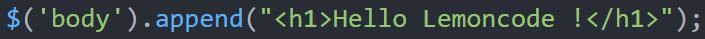

# JSX / TSX is that a good thing?

This repository has demos from the following [lemoncode blog post](http://www.formacion.lemoncode.net/lemoncode-blog/2016/3/31/jsx-tsx-que-tiene-de-bueno) (spanish version).

##To get started:
In samples [01 HTML inside JS](https://github.com/Lemoncode/MaterialPostTSX/tree/master/01%20HTML%20inside%20JS) and [02 HTML inside JS backticks](https://github.com/Lemoncode/MaterialPostTSX/tree/master/02%20HTML%20inside%20JS%20backticks) open index.html in browser.

To the rest samples:

1. Install [NodeJS](http://www.nodejs.org)  
2. `npm install webpack -g` - Installs webpack
3. `npm install tsd -g` - Installs tsd
4. Download this repo
5. Open the command line of your choice and cd to the root directory of this repo on your machine  
6. `npm install` - Installs packages
7. `npm start` - Builds the project and launch a lite web server (webpack-devserver).
8. Navigate to [http://localhost:8080/](http://localhost:8080/) if your browser doesn't open automatically.

##JSX / TSX is that a good thing? (english version):
One of the matters that wonder us when we have first look at React is that ‘HTML’ is embedded in JavaScript files… due to this many of developers have rejected it, assuming that involves going back to ‘Spaghetti code’, breaking principles as ‘Separation of concerns’.

On my own, I couldn’t understand how the good practices were breaking so flagrant, meanwhile really big IT enterprise such as Facebook, Airbnb, Uber, Yahoo, … embraced it as standard. Is there a piece of puzzle that we’re missing? Let’s dig a bit to figure out what is this about.

###EXAMPLES
Nowadays, when we were adding HTML to our JavaScript code, we insert a _string_:

